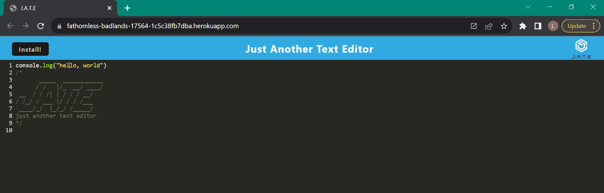

# PWA-Text-Editor

## Description

A single-page text editing application that meets PWA criteria.

## Installation and Usage

Type ```npm run install``` into the CLI to install necessary packages. From there, open the [deployed application](https://fathomless-badlands-17564-1c5c38fb7dba.herokuapp.com/) in a browser. You can use the text editor directly in the browser. To use offline, click the "Install!" button in the upper lefthand corner of the page.



## Technologies Used

* Webpack
* Babel
* Express.js
* IndexedDB

## Credits

N/A

## License

Please refer to the LICENSE in the repo.